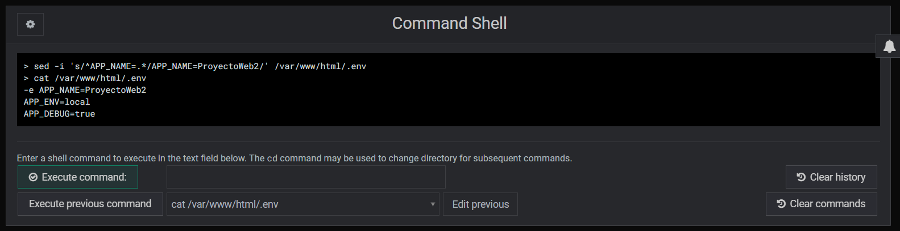
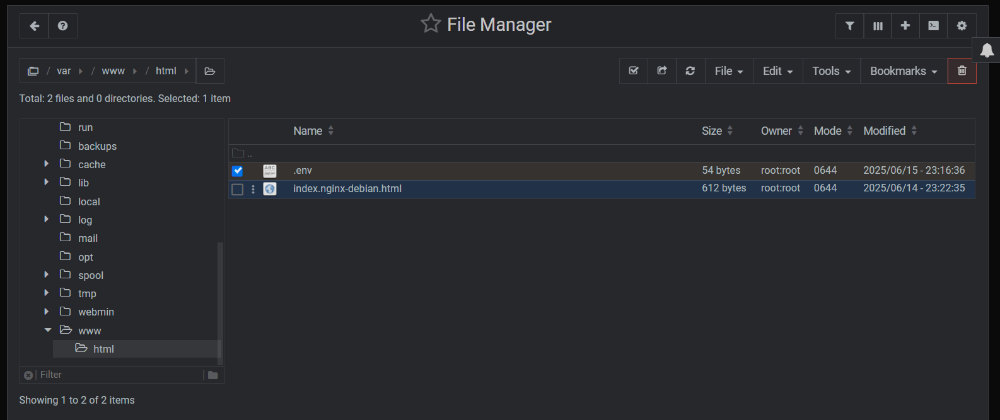

  

## Seminario de Administración de Sistemas  
**Clase:** Sistemas Operativos 1  
**Nombre:** Widmer Gustavo Santos Blas  
**Carné:** 9989-20-2472  

---

## 📌 Introducción

**Webmin** es una herramienta basada en web para la administración de sistemas Unix/Linux. Proporciona una interfaz gráfica amigable que permite configurar servicios y recursos del sistema como usuarios, discos, servicios de red, Apache, DNS, entre otros, sin necesidad de utilizar la línea de comandos. Su enfoque es facilitar la administración remota y centralizada de servidores.

---

## ⚙️ Desarrollo

> En esta sección se incluirán capturas de pantalla del proceso de configuración y administración utilizando Webmin, junto con una explicación detallada de cada paso ejecutado.

# COMANDOS A UTILIZAR PARA MODIFICAR VARIABLES DE ENTORNO   
## 1. Crear una variable nueva
>echo -e "APP_NAME=MiProyectoWeb\nAPP_ENV=local\nAPP_DEBUG=true" > /var/www/html/.env
## 2. Verificar que se creó:
>cat /var/www/html/.env
## 3. Contenido a visualizar:
>APP_NAME=MiProyectoWeb
APP_ENV=local
APP_DEBUG=true

  

## Si queremos modificarlo despues:
usando sed por ejemplo:
>sed -i 's/^APP_NAME=.*/APP_NAME=NuevoNombre/' /var/www/html/.env

##Si queremos modificarlo desde el File Manager
Nos vamos a la ruta del .env creada:

  

Clic derecho editar:

  

---
# 🎥 VIDEO EXPLICATIVO

[🎥 Video explicativo sobre la creación y modificación de variables de entorno en Webmin](https://drive.google.com/file/d/1m3Zg4Sn3iFsrhbr7z7r6pZnSWV_uKY1x/view?usp=sharing)

Este video muestra paso a paso cómo se accedió a Webmin, se localizó el archivo `/var/www/html/.env` y se realizaron modificaciones para definir variables de entorno en el sistema mediante la interfaz gráfica de Webmin y el Command Shell de Webmin.

---

## ✅ Conclusión

Durante el desarrollo de esta práctica, he comprendido cómo una herramienta como **Webmin** puede simplificar considerablemente la administración de un sistema operativo Linux. Pude visualizar de forma práctica cómo gestionar múltiples servicios del sistema desde un entorno web, eliminando la necesidad de recordar comandos complejos. Además, reforcé conocimientos sobre estructuras de archivos, usuarios y servicios internos del sistema.

---

## 🔍 Observaciones Adicionales

- La instalación de Webmin requiere considerar temas de seguridad, especialmente si se expone a internet. Es recomendable trabajar sobre HTTPS y restringir el acceso por IP como se hizo en esta practica.
- Webmin no utiliza variables de entorno definidas en archivos .env porque no está diseñado como una aplicación web moderna tipo framework (como Laravel, Django o Node.js).
- Si es necesario usar variables para aplicaciones web, eso se hace dentro de las aplicaciones mismas, no desde Webmin.
- La documentación oficial de Webmin es muy útil y clara: https://doxfer.webmin.com/
---

